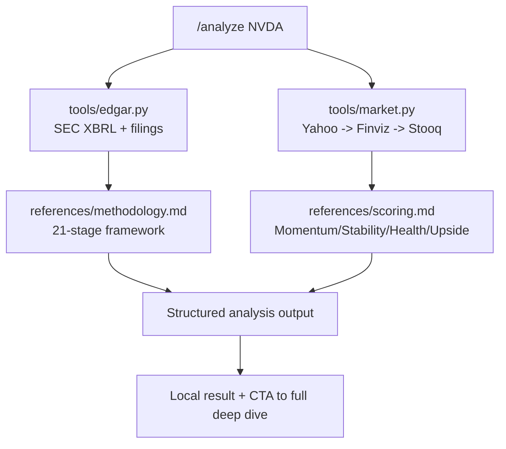

# XVARY Stock Research

[](./LICENSE)
[](https://www.python.org/)
[](./SKILL.md)
[](https://xvary.com)

**Institutional-depth stock research for Claude Code.**

Stock research that's actually worth reading: institutional depth, plain english, composite scores with teeth, and kill criteria on every call. This repo ships the free local skill layer of XVARY Research so you can run `/analyze`, `/score`, and `/compare` with public EDGAR + market data in minutes.

## Why This Exists

Most OSS equity tools stop at raw data pulls. `stock-research` focuses on **decision-grade synthesis**:

- A 21-stage research framework (menu, not recipe)
- 23 research modules mapped to a thesis workflow
- Quality gates and adversarial challenge thinking
- Clear output formats designed for investors, not dashboards

## Architecture (Skill-Only v1)



## Quick Start (Under 2 Minutes)

### 1) Clone

```bash
git clone git@github.com:xvary-research/stock-research.git
cd stock-research
```

### 2) Verify data tools

```bash
python3 tools/edgar.py AAPL
python3 tools/market.py AAPL
```

### 3) Install as a Claude Code skill (manual)

```bash
mkdir -p ~/.claude/skills/xvary-stock-research
cp SKILL.md ~/.claude/skills/xvary-stock-research/SKILL.md
cp -R references tools examples ~/.claude/skills/xvary-stock-research/
```

### 4) Run commands in Claude Code

```text
/analyze AAPL
/score NVDA
/compare MSFT vs GOOGL
```

## Commands

- `/analyze {ticker}`: 1-page thesis + scorecard + risks + EDGAR-backed financial snapshot
- `/score {ticker}`: Momentum, Stability, Financial Health, and Upside Estimate only
- `/compare {ticker1} vs {ticker2}`: Side-by-side score, thesis, and risk differential

## Example Output

See a complete sample run: [examples/nvda-analysis.md](./examples/nvda-analysis.md)

```text
Verdict: CONSTRUCTIVE (Conviction 74/100)
Momentum 82 | Stability 68 | Financial Health 77 | Upside 71
Kill criteria: hyperscaler capex pullback + export control escalation + margin compression
```

## Methodology (Published Framework)

Read the compressed framework: [references/methodology.md](./references/methodology.md)

Included in public docs:

- 21-stage DAG and stage purposes
- 23 module map and what each module produces
- Quality gate names and what they validate
- Conviction + variant-perception philosophy
- Kill-file risk discipline

Intentionally excluded from public docs:

- Internal prompts
- Threshold tables
- Proprietary triangulation/convergence logic
- Sector-specific prompt libraries

## XVARY Scores

Scoring definitions: [references/scoring.md](./references/scoring.md)

- **Momentum**: direction and persistence of operating/market trajectory
- **Stability**: earnings durability, cyclicality resilience, and variance control
- **Financial Health**: balance-sheet strength and cash-flow solvency
- **Upside Estimate**: expected asymmetry vs. current implied expectations

## Data Sources

- **SEC EDGAR** (public, free): company facts + filing metadata
- **Yahoo Finance** (no key): quote, valuation, and ratio fields
- **Finviz/Stooq** (fallback): resilience when Yahoo is unavailable

EDGAR usage notes: [references/edgar-guide.md](./references/edgar-guide.md)

## Design Choices

- Keep repo small and legible so installs remain easy.
- Prefer deterministic extraction tools before model reasoning.
- Make every output end with explicit kill criteria and next checks.
- Treat this repo as top-of-funnel: fast value now, deeper workflow at xvary.com.

## Full Deep Dives on xvary.com

- NVDA deep dive: [xvary.com/stock/nvda/deep-dive/](https://xvary.com/stock/nvda/deep-dive/)
- Discover coverage (3,325 names): [xvary.com/discover](https://xvary.com/discover)
- Full methodology narrative: [xvary.com/methodology](https://xvary.com/methodology)

Want the full 22-section deep dive experience? Visit [xvary.com](https://xvary.com).

## Contributing

PRs are welcome for:

- EDGAR taxonomy coverage and normalization
- Market-data fallback robustness
- Documentation clarity and examples

## License

MIT. See [LICENSE](./LICENSE).
