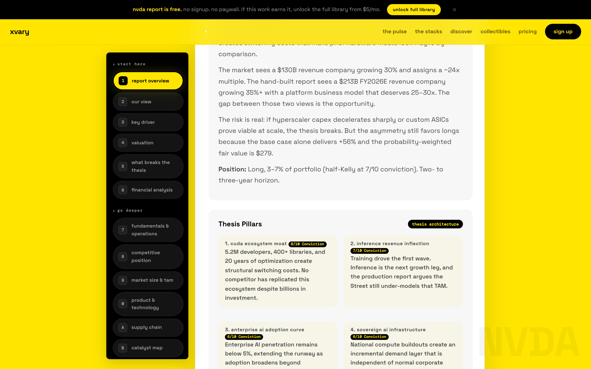
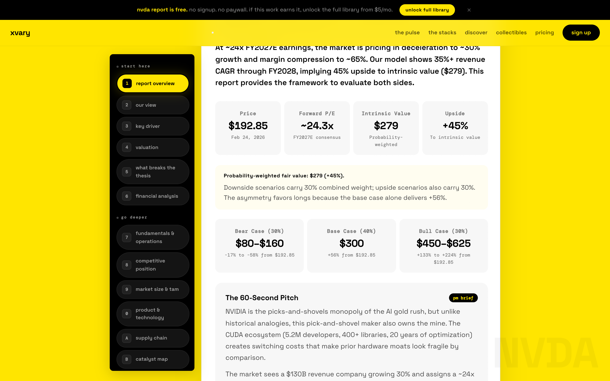
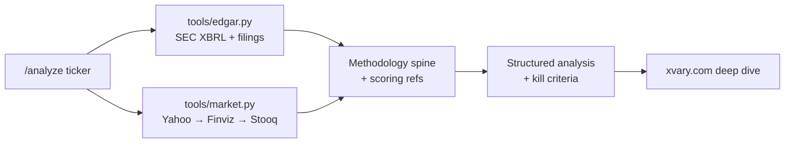
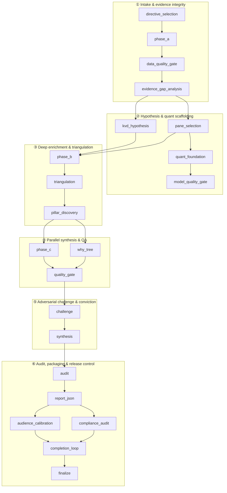

# XVARY Stock Research

[](./LICENSE)
[](https://www.python.org/)
[](./SKILL.md)
[](https://xvary.com)

Type `/analyze NVDA` in Claude Code and get a thesis-driven equity report with conviction scoring, kill criteria, and an EDGAR-backed financial snapshot -- in under two minutes, from public data, for free.

This is the open skill layer of [XVARY Research](https://xvary.com). We run a 21-stage pipeline to produce institutional-depth stock analysis. This repo gives you the methodology framework, the data tools, and the scoring models. The full 22-section deep dives live at [xvary.com](https://xvary.com).

*We recognize Linux Do community*

## From the live site (NVDA deep dive)

Captured from **[xvary.com/stock/nvda/deep-dive/](https://xvary.com/stock/nvda/deep-dive/)** — same product surface the skill is designed to complement.

<p align="center">
  <a href="https://xvary.com/stock/nvda/deep-dive/" title="Open NVDA deep dive"></a>
</p>
<p align="center">
  <a href="https://xvary.com/stock/nvda/deep-dive/" title="Open NVDA deep dive"></a>
</p>
<p align="center">
  <a href="https://xvary.com/stock/nvda/deep-dive/" title="Open NVDA deep dive"></a>
</p>

*Regenerate these assets:* `npm install && npm run screenshots:nvda` (see `scripts/screenshot_xvary_nvda.mjs`).

## What you get that raw data tools don't

- **A verdict, not a spreadsheet** -- "Constructive at 74/100 conviction"
- **Named kill criteria** -- exactly what would break the thesis
- **Composite scores across four dimensions**, not just price ratios
- **Analysis that reads like a research desk**, not a terminal dump

## Quick Start

### Clone and verify

```bash
git clone git@github.com:xvary-research/claude-code-stock-analysis-skill.git
cd claude-code-stock-analysis-skill
python3 tools/edgar.py AAPL    # pulls SEC XBRL data
python3 tools/market.py AAPL   # pulls price + ratios
```

**XVARY monorepo:** if you already have the full workspace, this skill lives at `9. Marketing/xvary skill/`.

### Install as a Claude Code skill

```bash
mkdir -p ~/.claude/skills/xvary-stock-research
cp SKILL.md ~/.claude/skills/xvary-stock-research/SKILL.md
cp -R references tools examples ~/.claude/skills/xvary-stock-research/
```

Or skip the install entirely -- open Claude Code in this repo and say:

```
Read SKILL.md and run /analyze AAPL
```

**Plugin marketplace (same folder):** open this directory as the marketplace root (it contains `.claude-plugin/marketplace.json`), then in Claude Code run `/plugin marketplace add .` and `/plugin install xvary-stock-research@xvary-research`. Validate with `claude plugin validate .` before you tag a release.

**Public GitHub checkout:** `/plugin marketplace add xvary-research/claude-code-stock-analysis-skill` then `/plugin install xvary-stock-research`.

### Commands

| Command | What it does |
|---|---|
| `/analyze {ticker}` | 1-page thesis + scorecard + risks + EDGAR-backed financial snapshot |
| `/score {ticker}` | Momentum, Stability, Financial Health, and Upside Estimate |
| `/compare {A} vs {B}` | Side-by-side score, thesis, and risk differential |

## Example: `/analyze NVDA`

Full example: [examples/nvda-analysis.md](./examples/nvda-analysis.md)

```
Verdict: CONSTRUCTIVE (Conviction 74/100)

┌─────────────────┬───────┬──────────────────────────────────────────────┐
│ Score           │ Value │ Read                                         │
├─────────────────┼───────┼──────────────────────────────────────────────┤
│ Momentum        │  88   │ Demand + operating leverage remain strong    │
│ Stability       │  70   │ Strong execution, non-zero cyclicality risk  │
│ Financial Health│  84   │ Robust balance sheet vs obligations          │
│ Upside Estimate │  64   │ Positive setup, expectations already high    │
└─────────────────┴───────┴──────────────────────────────────────────────┘

Thesis pillars:
  1. AI infrastructure spend durability
  2. CUDA ecosystem lock-in + pricing power
  3. Operating leverage on incremental revenue
  4. Balance-sheet capacity through cycle volatility

Kill criteria: hyperscaler capex pullback + export control
escalation + gross-margin break with rising capex intensity

Financial snapshot (public, 10-K 2026-01-25):
  Revenue $215.9B · Net income $120.1B · OCF $102.7B
  Assets $206.8B / Liabilities $49.5B
  Price $172.70 · Market cap ~$4.20T · P/E 35.23 · Beta 2.34
```

**This is the free layer.** The full pipeline produces 22-section reports with DCF models, competitive matrices, risk scenarios, and adversarial challenge gates.

**Open the live NVDA report:** [xvary.com/stock/nvda/deep-dive/](https://xvary.com/stock/nvda/deep-dive/) (free preview; full tabs with subscription)

## How this compares

|  | Raw data MCPs | Screener APIs | **This repo** |
|---|---|---|---|
| Free | Varies | Usually no | **Yes** |
| Thesis with verdict | No | No | **Yes** |
| Named kill criteria | No | No | **Yes** |
| Composite scoring (4 dimensions) | No | Partial | **Yes** |
| Works locally, no API key | N/A | No | **Yes** |
| Methodology published | N/A | No | **Yes** |

## Architecture

**Skill layer (this repo):** public data in → methodology + scoring → structured output → link out to full deep dives on [xvary.com](https://xvary.com).

### Claude Code plugin bundle (ships in this folder)

| Path | Role |
|------|------|
| `.claude-plugin/marketplace.json` | Marketplace catalog **`xvary-research`** — users run `/plugin marketplace add` from this directory |
| `plugins/xvary-stock-research/` | Plugin wrapper; `skills/xvary-stock-research/` symlinks to root `SKILL.md`, `references/`, `tools/`, `examples/` so there is a single source tree |

**Monorepo checkout:** open a terminal in **`9. Marketing/xvary skill/`** (this folder), then run `/plugin marketplace add .` in Claude Code — same as a standalone `claude-code-stock-analysis-skill` clone where this folder is the repo root.



### 21-stage research spine + finalize (operational DAG)

Same DAG as [references/methodology.md](./references/methodology.md): **22 nodes in code** (research spine + `finalize`). Edges show real control flow—parallel paths merge at **phase_b**, **quality_gate**, and **completion_loop**.



<details>
<summary><b>Stage index (one-line intent)</b> — click to expand</summary>

| # | Stage | Intent |
|---|--------|--------|
| 1 | `directive_selection` | Choose sector/style evidence directives |
| 2 | `phase_a` | Baseline facts, filings, market context |
| 3 | `data_quality_gate` | Block low-integrity factual inputs |
| 4 | `evidence_gap_analysis` | Find gaps; open targeted searches |
| 5 | `kvd_hypothesis` | Candidate key value drivers |
| 6 | `pane_selection` | Choose report panes for company profile |
| 7 | `quant_foundation` | Valuation / risk scaffolding |
| 8 | `model_quality_gate` | Sanity-check model outputs |
| 9 | `phase_b` | Enrichment + deeper context |
| 10 | `triangulation` | Cross-check independent reasoning vectors |
| 11 | `pillar_discovery` | Weighted thesis pillars |
| 12 | `phase_c` | Module-level synthesis (parallel) |
| 13 | `why_tree` | Causal claims + dependency chains |
| 14 | `quality_gate` | Consistency + evidence sufficiency |
| 15 | `challenge` | Adversarial test of pillars |
| 16 | `synthesis` | Conviction, variant view, scenarios |
| 17 | `audit` | Multi-role verification + follow-ups |
| 18 | `report_json` | Structured report payload |
| 19 | `audience_calibration` | Readability + decision speed |
| 20 | `compliance_audit` | Methodology + policy checks |
| 21 | `completion_loop` | Repair sparse / inconsistent sections |
| 22 | `finalize` | Release gating + artifact finalization |

</details>

## XVARY Scores

Definitions: [references/scoring.md](./references/scoring.md)

| Score | What it measures |
|---|---|
| **Momentum** | Direction and persistence of operating + market trajectory |
| **Stability** | Earnings durability, cyclicality resilience, variance control |
| **Financial Health** | Balance-sheet strength and cash-flow solvency |
| **Upside Estimate** | Asymmetry vs. current implied expectations |

## Methodology (Published Framework)

Full framework: [references/methodology.md](./references/methodology.md)

What's published:
- 21-stage research DAG with stage purposes
- 23 module map and what each module produces
- Quality gate names and validation criteria
- Conviction scoring and variant-perception philosophy
- Kill-file risk discipline

What stays proprietary:
- LLM prompts and chain-of-thought templates
- Threshold tables and scoring formulas
- Triangulation and convergence algorithms
- Sector-specific prompt libraries

## Data Sources

| Source | Access | Used for |
|---|---|---|
| **SEC EDGAR** | Public, free | Company facts (XBRL) + filing metadata |
| **Yahoo Finance** | No API key | Quote, valuation, ratio fields |
| **Finviz / Stooq** | Fallback | Resilience when Yahoo is unavailable |

EDGAR patterns: [references/edgar-guide.md](./references/edgar-guide.md)

## Full Deep Dives

| Ticker | Link |
|---|---|
| NVDA | [xvary.com/stock/nvda/deep-dive/](https://xvary.com/stock/nvda/deep-dive/) |
| All coverage (3,325 names) | [xvary.com/discover](https://xvary.com/discover) |
| Methodology narrative | [xvary.com/methodology](https://xvary.com/methodology) |

## Roadmap

- [ ] MCP server for on-demand full deep dives
- [ ] Earnings-season auto-refresh triggers
- [ ] Additional scoring models (earnings quality, capital allocation)
- [ ] Cursor / Windsurf / Codex skill mirrors (Claude Code marketplace ships from this folder)

## Contributing

PRs welcome for:
- EDGAR taxonomy coverage and normalization
- Market-data fallback robustness
- Documentation clarity and examples

## License

MIT. See [LICENSE](./LICENSE).
